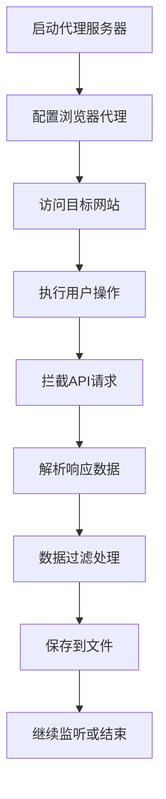

# 高效代理爬虫系统 - 项目总览

## 📋 项目简介

这是一个基于Python的高效代理爬虫系统，专门设计用于通过流量抓包的方式获取网站后台API返回的结构化数据，而不是传统的网页元素抓取方式。

### 🎯 核心理念

- **流量拦截优于元素抓取**: 直接获取API返回的结构化数据，避免网页结构变化导致的程序失效
- **代理自动化**: 自动配置和管理代理服务器（mitmproxy/Proxifier）
- **智能数据处理**: 自动识别、解析和存储API响应数据
- **高度可配置**: 支持多种网站类型和使用场景

## 📁 项目结构

```
advanced_crawler/
├── 📄 核心文件
│   ├── proxy_crawler.py          # 完整版爬虫（高级功能）
│   ├── simple_proxy_crawler.py   # 简化版爬虫（易于使用）
│   ├── config_examples.py        # 配置示例（10+种场景）
│   └── examples.py               # 使用示例（实际案例）
│
├── 🛠️ 工具脚本
│   ├── install.py                # 自动安装脚本
│   ├── quick_start.py            # 快速启动工具
│   └── test_system.py            # 系统测试脚本
│
├── 📚 文档文件
│   ├── README.md                 # 详细使用说明
│   ├── PROJECT_OVERVIEW.md       # 项目总览（本文件）
│   └── requirements.txt          # 依赖包列表
│
└── 📂 数据目录（运行时创建）
    ├── data/                     # 爬取数据存储
    ├── logs/                     # 日志文件
    ├── config/                   # 配置文件
    ├── output/                   # 输出文件
    └── temp/                     # 临时文件
```

## 🚀 快速开始指南

### 1. 安装系统

```bash
# 方法一：自动安装（推荐）
python install.py

# 方法二：手动安装
pip install -r requirements.txt
python -m playwright install
```

### 2. 运行测试

```bash
# 测试系统是否正常工作
python test_system.py
```

### 3. 快速启动

```bash
# 交互式启动
python quick_start.py

# 直接运行测试爬虫
python quick_start.py -c test

# 运行电商爬虫
python quick_start.py -c ecommerce
```

## 🔧 核心组件详解

### 1. 代理系统 (Proxy System)

- **mitmproxy集成**: 自动启动和配置mitmproxy代理服务器
- **流量拦截**: 实时拦截HTTP/HTTPS请求和响应
- **智能过滤**: 根据域名和API路径过滤目标数据

### 2. 浏览器控制 (Browser Control)

- **Playwright集成**: 支持Chromium、Firefox、Safari
- **自动化操作**: 模拟用户行为触发API调用
- **代理配置**: 自动配置浏览器使用代理

### 3. 数据处理 (Data Processing)

- **自动解析**: 支持JSON、XML、HTML等格式
- **数据过滤**: 可自定义数据过滤规则
- **格式转换**: 统一的数据输出格式
- **去重处理**: 避免重复数据

### 4. 存储系统 (Storage System)

- **多格式支持**: JSON、CSV、数据库等
- **分类存储**: 按时间、域名、API类型分类
- **压缩存储**: 可选的数据压缩

## 📊 支持的网站类型

| 类型 | 配置名称 | 主要网站 | 特点 |
|------|----------|----------|------|
| 电商 | ecommerce | 淘宝、京东、拼多多 | 商品信息、价格、评论 |
| 社交媒体 | social_media | 微博、Twitter、抖音 | 动态、评论、用户信息 |
| 新闻资讯 | news | 新浪、网易、今日头条 | 文章、评论、热点 |
| 金融数据 | financial | 东方财富、同花顺 | 股价、K线、财报 |
| 招聘信息 | job_search | Boss直聘、拉勾 | 职位、薪资、公司 |
| 房产信息 | real_estate | 链家、安居客 | 房价、租金、小区 |
| 旅游出行 | travel | 携程、去哪儿 | 机票、酒店、景点 |
| 测试调试 | test | 测试API | 开发调试用 |

## 🎛️ 配置系统

### 预定义配置

系统提供了10+种预定义配置，覆盖主流网站类型：

```python
from config_examples import get_config_by_name

# 获取电商配置
config = get_config_by_name("ecommerce")

# 获取所有可用配置
configs = list_available_configs()
```

### 自定义配置

```python
from proxy_crawler import CrawlerConfig

config = CrawlerConfig(
    target_domains=["api.example.com"],
    target_apis=["/api/data"],
    proxy_port=8080,
    output_dir="./my_data"
)
```

## 🔄 工作流程



## 📈 性能特点

- **高并发**: 支持多线程/异步处理
- **低延迟**: 直接获取API数据，无需解析DOM
- **高准确性**: 结构化数据，避免页面变化影响
- **可扩展**: 模块化设计，易于扩展新功能

## 🛡️ 安全考虑

- **代理隔离**: 代理服务器与主程序分离
- **数据加密**: 支持HTTPS流量拦截
- **访问控制**: 可配置目标域名白名单
- **频率限制**: 内置请求频率控制

## 🔧 高级功能

### 1. 数据过滤器

```python
def custom_filter(data):
    # 只保留状态码为200的请求
    return data.get('status_code') == 200

crawler.set_data_filter(custom_filter)
```

### 2. 自定义处理器

```python
def custom_processor(data):
    # 提取关键信息
    return {
        'title': data.get('title'),
        'price': data.get('price'),
        'timestamp': time.time()
    }

crawler.set_custom_processor(custom_processor)
```

### 3. 实时数据流

```python
def real_time_handler(data):
    # 实时处理数据
    print(f"收到数据: {data['url']}")
    # 发送到消息队列、数据库等

crawler.set_real_time_handler(real_time_handler)
```

## 🔌 扩展集成

### 数据库集成

```python
# MongoDB
from pymongo import MongoClient

# MySQL
import mysql.connector

# Redis
import redis
```

### 消息队列

```python
# RabbitMQ
import pika

# Kafka
from kafka import KafkaProducer
```

### 云存储

```python
# AWS S3
import boto3

# 阿里云OSS
import oss2
```

## 🐛 故障排除

### 常见问题

1. **代理启动失败**
   - 检查端口是否被占用
   - 确认mitmproxy安装正确

2. **浏览器无法连接**
   - 检查代理配置
   - 确认防火墙设置

3. **数据未拦截**
   - 检查目标域名配置
   - 确认API路径匹配

4. **性能问题**
   - 调整并发数量
   - 增加请求延迟

### 调试模式

```bash
# 启用详细日志
python quick_start.py -c test --debug

# 显示浏览器窗口
python quick_start.py -c test --no-headless
```

## 📝 开发计划

### 近期计划

- [ ] 添加更多网站配置
- [ ] 优化数据处理性能
- [ ] 增加图形界面
- [ ] 支持分布式部署

### 长期计划

- [ ] AI智能识别API
- [ ] 自动反反爬虫
- [ ] 云端服务版本
- [ ] 企业级功能

## 🤝 贡献指南

1. Fork项目
2. 创建功能分支
3. 提交更改
4. 发起Pull Request

### 贡献方向

- 新增网站配置
- 优化性能
- 修复Bug
- 完善文档
- 添加测试

## 📄 许可证

MIT License - 详见LICENSE文件

## 📞 支持与反馈

- **问题报告**: 通过GitHub Issues
- **功能建议**: 通过GitHub Discussions
- **技术交流**: 欢迎提交PR

---

**最后更新**: 2024年12月
**版本**: 1.0.0
**维护者**: 项目团队