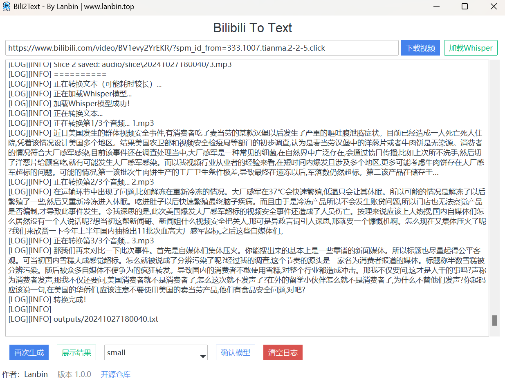
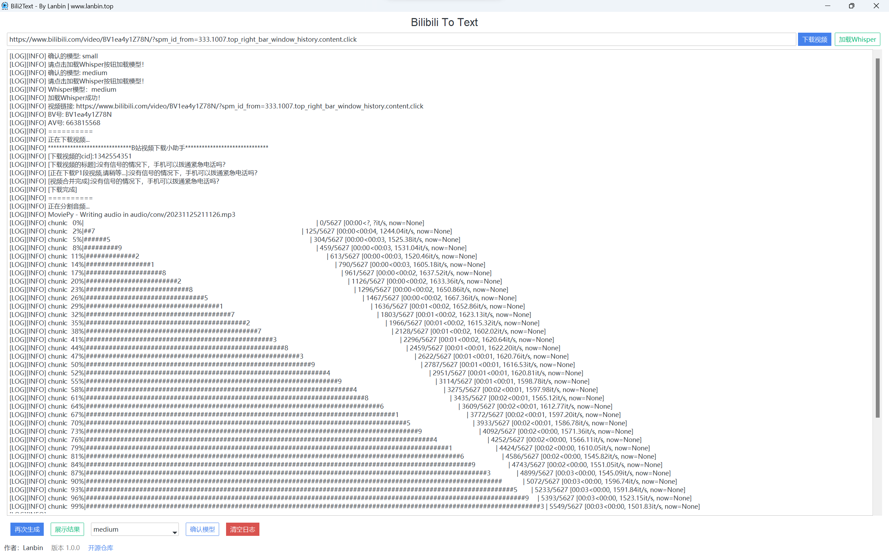
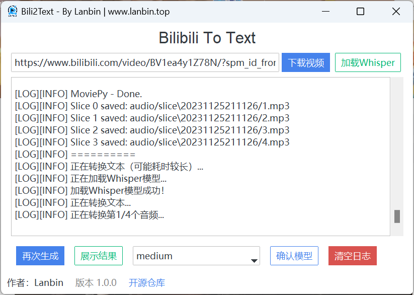
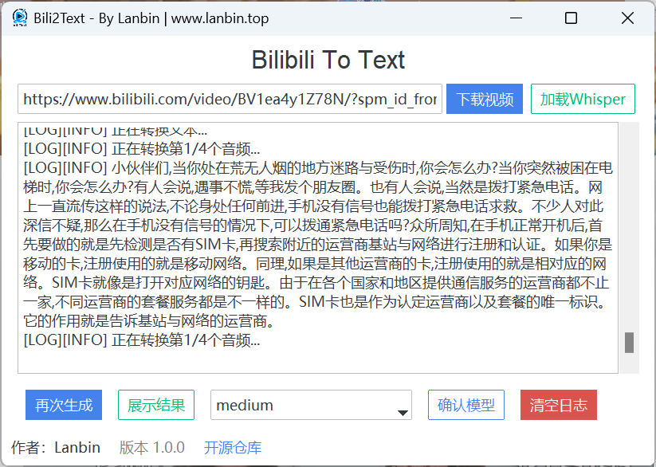

<p align="center">
  
</p>


<p align="center">
    
    
    
    
</p>

# Bili2text 📺

针对Issue中提出的问题，作者很快会一个一个解决。同时也希望大家可以一起帮忙贡献！

感谢大家一年多来的支持！



！！**目前讯飞功能暂未实现**

## 简介 🌟
bili2text 是一个用于将 Bilibili 视频转换为文本的工具🛠️。这个项目通过一个简单的流程实现：下载视频、提取音频、分割音频，并使用 whisper 模型将语音转换为文本。整个过程是自动的，只需输入 Bilibili 视频的 av 号即可。整个过程行云流水，一步到胃😂

## 功能 🚀
- 🎥**下载视频**：从 Bilibili 下载指定的视频。
- 🎵**提取音频**：从下载的视频中提取音频。
- 💬**音频分割**：将音频分割成小段，以便于进行高效的语音转文字处理。
- 🤖**语音转文字**：使用 OpenAI 的 whisper 模型将音频转换为文本。

## 使用方法 📘
1. **克隆仓库**：
   ```bash
   git clone https://github.com/lanbinshijie/bili2text.git
   cd bili2text
   ```

2. **安装依赖**：
   安装必要的 Python 库。
   ```bash
   pip install -r requirements.txt
   ```

3. **运行脚本**：
   使用 Python 运行 `main.py` 脚本。
   ```python
   python main.py
   ```

   在提示时输入 Bilibili 视频的 av 号。

4. **使用UI界面**：
   ```bash
   python window.py
   ```

   在弹出的窗口中输入视频链接，会自动转换为av号，点击下载视频按钮即可完成文件转换。

## YouTube 下载故障排查（代理/SSL）🔧
当你在日志中看到以下报错时，通常不是 cookies 失效，而是代理链路抖动导致：

- `SSL: UNEXPECTED_EOF_WHILE_READING`
- `Connection to www.youtube.com timed out`

### 快速自检
用同一份 cookies 和代理先跑一条元数据请求（不真正下载）：

```bash
/Users/fullmetal/Documents/codes/RPA/yt-dlp_macos \
  -v --skip-download --no-playlist \
  --proxy "http://127.0.0.1:7897" \
  --js-runtimes node \
  --cookies /Users/fullmetal/Documents/codes/RPA/youtube_cookies.txt \
  --print "%(id)s|%(title)s" \
  "https://www.youtube.com/watch?v=<VIDEO_ID>"
```

若这条命令能稳定输出 `id|title`，说明 cookies 可用，主要是网络稳定性问题。

### 处理建议
1. 重启或切换代理节点，优先保证访问 `youtube.com` 与 `googlevideo.com` 稳定。
2. 使用重试与超时参数（`retries / fragment-retries / socket-timeout`）提高成功率。
3. 如网络环境对 IPv6 不稳定，启用 `--force-ipv4`。
4. 确保本机可用 Node.js（YouTube 挑战求解需要 `--js-runtimes node`）。

### 代码内置行为（仅 YouTube）
`downBili.py` 已为 YouTube 请求自动注入代理容错参数，Bili/Douyin 不受影响。  
代理读取优先级如下：

1. `YTDLP_PROXY`
2. `YOUTUBE_PROXY`
3. `HTTPS_PROXY` / `https_proxy`
4. `HTTP_PROXY` / `http_proxy`
5. 默认值 `http://127.0.0.1:7897`

### Feishu / OpenClaw 日志快速判断
在 OpenClaw 环境里，优先看 `gateway.err.log` 的 `video-extractor` 条目：

```bash
rg -n "video-extractor|yt-dlp 执行失败|UNEXPECTED_EOF|timed out|Sign in|403|cookies" ~/.openclaw/logs/gateway.err.log -S
```

常见判断规则：

1. 出现 `UNEXPECTED_EOF`、`timed out`：优先判断为代理链路不稳。
2. 出现 `Sign in to confirm`、`This video is private`、`403 Forbidden`（且无网络错误）：优先检查 cookies/账号权限。
3. 若仅看到 `发生错误: 下载失败` 且无上下文：升级到最新代码，错误会直接附带 `stage/return_code/command/排查建议`。

建议先跑测试用例做本地排查（在 `RPA` 项目根目录执行）：

```bash
python -m unittest bili2text/test/test_downbili_youtube_args.py
python -m unittest bili2text.test.test_downbili_youtube_args.TestDownBiliYoutubeArgs.test_resolve_youtube_proxy_priority
python -m unittest bili2text.test.test_downbili_youtube_args.TestDownBiliYoutubeArgs.test_download_audio_new_adds_youtube_network_args
```

## 示例 📋
```python
from downBili import download_video
from exAudio import *
from speech2text import *

av = input("请输入av号：")
filename = download_video(av)
foldername = run_split(filename)
run_speech_to_text(foldername, prompt="以下是普通话的句子。这是一个关于{}的视频。".format(filename))
output_path = f"outputs/{foldername}.txt"
print("转换完成！", output_path)
```

## 技术栈 🧰
- [Python](https://www.python.org/) 主要编程语言，负责实现程序逻辑功能
- [Whisper](https://github.com/openai/whisper) 语音转文字模型
- [FunASR ct-punc](https://github.com/modelscope/FunASR) 标点恢复模型
- [Tkiner](https://docs.python.org/3/library/tkinter.html) UI界面展示相关工具
- [TTKbootstrap](https://ttkbootstrap.readthedocs.io/en/latest/zh/) UI界面美化库

## 标点恢复（punctuation restoration）

字幕文件（`.ai-zh.srt`）通常不含标点。`restore_punctuation()` 使用 FunASR ct-punc 模型为纯文本恢复中文标点。

### 性能关键点

**问题**：`AutoModel.generate()` 每次调用有 ~900ms 的 tqdm + prepare_data_iterator 开销，模型 forward 只要 ~20ms。

**方案**：直接调 `model.model.inference()` 绕过包装层，**48x 加速**。

| 方式 | 单行耗时 | 200行耗时 |
|------|----------|-----------|
| `model.generate()` | 0.9s | 189s |
| `model.inference()` 直调 | 0.02s | 3.5s |

**ct-punc 限制**：不支持 batch（`assert len(data_in) == 1`），必须逐行调用。

### 架构

```
speech2text.py                    punct_daemon.py
┌─────────────────────┐           ┌──────────────────────┐
│ restore_punctuation  │──socket──▶│ Unix socket listener │
│   1. try daemon      │           │   model loaded once  │
│   2. fallback: local │           │   threaded clients   │
└─────────────────────┘           └──────────────────────┘
         │
         ▼ (fallback)
  AutoModel("ct-punc")
  → inner.inference() 直调
```

- **daemon**（`punct_daemon.py`）：常驻进程，模型加载一次，通过 TCP localhost 响应多次请求（兼容 Windows / macOS / Linux）
- **监听地址**：`127.0.0.1:19832`（可由 `OPENCLAW_PUNCT_HOST` / `OPENCLAW_PUNCT_PORT` 覆盖）
- **自动启动**：`restore_punctuation()` 首次调用时自动启动 daemon；OpenClaw 插件 `register()` 也会预热
- **fallback**：daemon 不可用时回退到进程内加载（仍用 `inference()` 直调，只是多了模型加载时间）

### 文件清单

| 文件 | 职责 |
|------|------|
| `speech2text.py` | `restore_punctuation()` 入口，daemon 客户端 + fallback |
| `punct_daemon.py` | 标点恢复 daemon，TCP localhost 服务 |
| `main.py` | `BiliSpeechPipeline.process_job()` 字幕路径调用 `restore_punctuation()` |
| `test/test_punct_restore.py` | 单元测试 + 集成测试 |

### 环境变量

| 变量 | 默认值 | 说明 |
|------|--------|------|
| `OPENCLAW_PUNCT_HOST` | `127.0.0.1` | daemon 监听地址 |
| `OPENCLAW_PUNCT_PORT` | `19832` | daemon 监听端口 |

### 测试

```bash
# 单元测试（不需要模型，快速）
python -m pytest bili2text/test/test_punct_restore.py -v -k "Unit or Protocol or TryDaemon"

# 集成测试（需要 funasr + 模型下载，慢）
RUN_SLOW_TESTS=1 python -m pytest bili2text/test/test_punct_restore.py -v
```

## 后续开发计划 📅

- [X] 生成requirements.txt
- [X] UI化设计


## 运行截图 📷
<!-- assets/screenshot1.png -->




## Star History ⭐

[](https://star-history.com/#lanbinshijie/bili2text&Date)


## 许可证 📄
本项目根据 MIT 许可证发布。

## 贡献 💡
如果你想为这个项目做出贡献，欢迎提交 Pull Request 或创建 Issue。

## 致谢 🙏
再此感谢Open Teens对青少年开源社区做出的贡献！[@OpenTeens](https://openteens.org)
